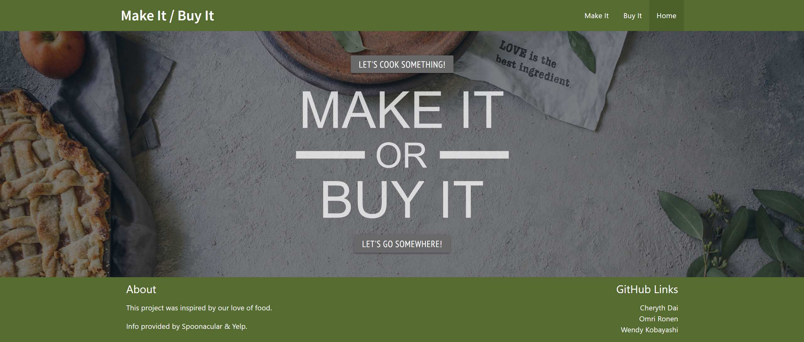
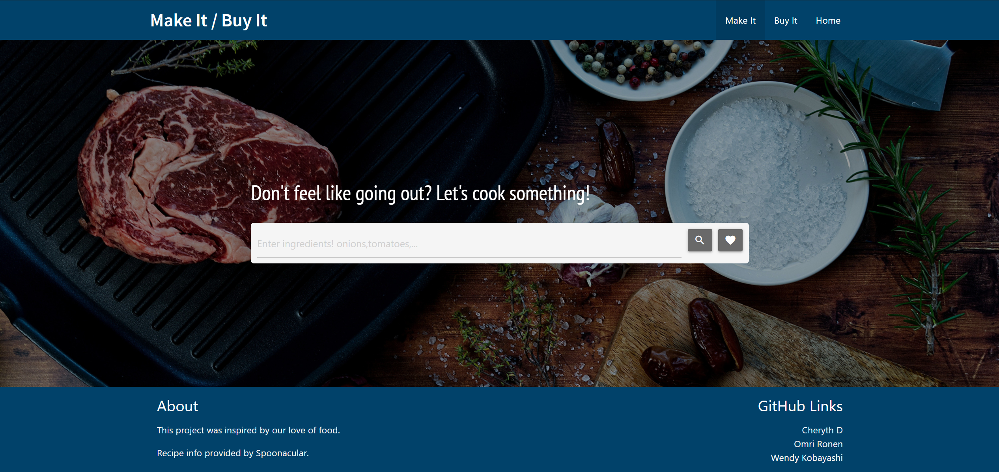
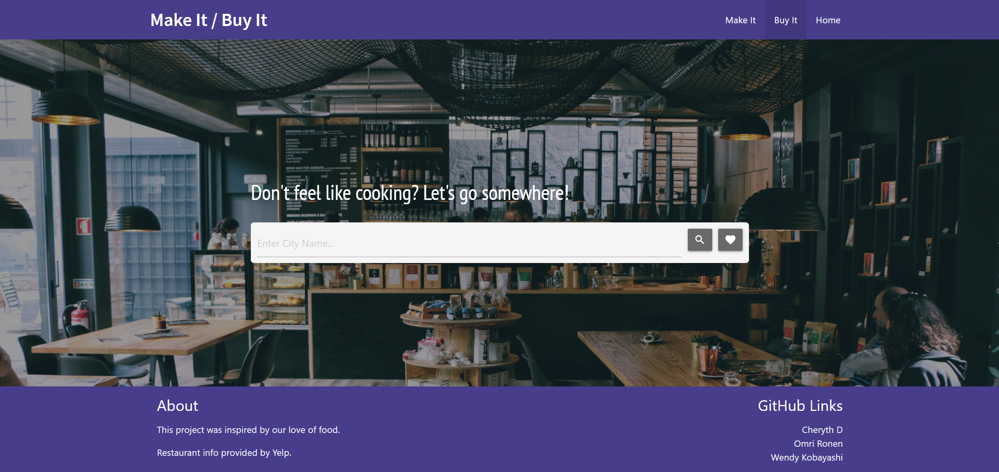

# Make It | Buy It

## Link
https://iamalittleforest.github.io/make-it-buy-it/

## Languages & Technologies Used
1. HTML
2. Materialize CSS
3. JavaScript & JQuery
4. Spoonacular API & Yelp API

## Description:

The Make it / Buy It application is designed to help users who need help with deciding on their next meal. If a user decides to “Make It,” they will navigate to a page that will pull up recipes based on ingredients that the user wants to use. On the other hand, if the user decides to “Buy It,” they will navigate to a page that will pull up restaurants based on a location the user chooses.

## User Story
```
AS A foodie
I WANT to know what recipes I can make and what restaurants are nearby
SO THAT I can decide whether I want to make it or buy it
```

## Screenshots




## License
MIT License

## Team Members 
- [Wendy Kobayashi](https://github.com/iamalittleforest)
- [Cheryth Dai](https://github.com/ChengyuD)
- [Omri Ronen](https://github.com/Omrironen4)
